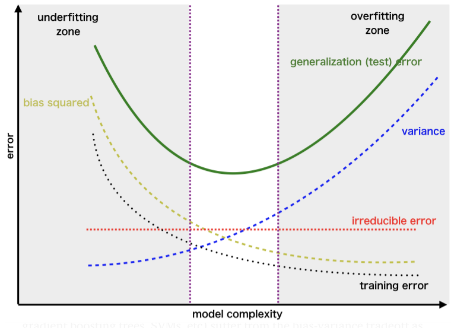

# Wine Classification Analysis

**Task: Wine Classification**

We are tasked to produce a machine learning model that classifies wines. We have been given a dataset with 13 variables that are used in classifying the wines, and it would be ideal to produce a model with fewer variables. If we can produce a model with only 2 variables, we can visually observe the predictive regions and boundaries. In addition, evaluate the model and perform parameter tuning to improve the model.

We will be producing a machine learning model to classify wines using "Dimensionality Reduction", "K-Fold Cross Validation" and "Grid Search" for model evaluation and tuning.

## Dimensionality Reduction

There are two types of Dimensionality Reduction techniques, they are:

- Feature Selection
- Feature Extraction

Feature Selection techniques include "Backward Elimination", "Forward Selection", "Bidirectional Elimination", "Score Comparison" ... etc. For the dataset under study, we will be using the Feature Extraction techniques listed below:

- Principal Component Analysis (PCA)
- Kernel Principal Component Analysis (Kernel PCA)
- Linear Discriminant Analysis (LDA)

### Principal Component Analysis - PCA

PCA is one of the most used unsupervised algorithms, and the most popular Dimensionality Reduction Algorithm. PCA is used for operations such as:
- Noise filtering
- Visualisation
- Feature extraction
- Stock market predictions
- Gene data analysis

The goal of PCA is to identify patterns in the data and detect the correlation between variables. If we find a strong correlation, we can reduce the dimensionality. In essence, we reduce the dimensions of a d-dimensional dataset by projecting it onto a k-dimensional subspace, where (k is less than or equal to d).

**PCA Breakdown**

- Standardise the data.
- Obtain the Eigenvectors and Eigenvalues from the covariance matrix or correlation matrix, or perform Singular Vector Decomposition.
- Sort the Eigenvalues in descending order and choose the k Eigenvectors that correspond to the k largest Eigenvalues, where k is the number of dimensions of the new feature subspace (k less than or equal to d).
- Construct the projection matrix W from the selected k Eigenvectors.
- Transform the original dataset X via W to obtain a k-dimensional feature subspace Y.

**Summary**

From the m independent variables of our dataset, PCA extracts (p less than or equal to m) new independent variables that explains most of the variance of the dataset, regardless of the dependent variable. As the dependent variable is not considered, this makes PCA an unsupervised model.

The below code is used when appling the PCA.

```
from sklearn.decomposition import PCA
pca = PCA(n_components = None)
X_train = pca.fit_transform(X_train)
X_test = pca.transform(X_test)
explained_variance = pca.explained_variance_ratio_
```

Let's observe the outcome of the explained variance.

```
In [1]: explained_variance
Out[2]: 
array([0.37281068, 0.18739996, 0.10801208, 0.07619859, 0.06261922,
       0.04896412, 0.0417445 , 0.02515945, 0.02340805, 0.0184892 ,
       0.01562956, 0.01269224, 0.00687236])
```

From the output above, we state that 0.56 of the variance (0.37 + 0.19) is contributed by two variables, indicating that we may reduce the dimensionality of the dataset. For the dataset under study, the python files attached take 2 variables which allow us to visually plot the predictive regions.

### Kernel Principal Component Analysis - Kernel PCA

This is used when the data is non-linearly seperable. We map the data to a higher dimension using the Gaussian RBF kernel. We then extract new principle components from there and see how it manages to deal with non-linear problems.

The code below is used when applying the Kernel PCA.

```
from sklearn.decomposition import KernelPCA
pca = KernelPCA(n_components = 2, kernel = 'rbf')
X_train = pca.fit_transform(X_train)
X_test = pca.transform(X_test)
```

**Note**

Unlike the PCA algorithm discussed previously, the below code cannot be used in this case.

```
explained_variance = pca.explained_variance_ratio_
```
We will therefore set n_components = 2 and move on from there.

### Linear Discriminant Analysis - LDA

LDA is a dimensionality reduction technique that is used in the preprocessing step for pattern classification. The goal is to project the dataset under study onto a lower dimensional space. LDA differs from PCA because, in addition to finding the component axises, with LDA we are interested in the axes that maximise the seperation between multiple classes. Therefore, from the n independent variables of the dataset under study, LDA extracts (p less than or equal to n) new independent variables that seperate the most of the classes of the independent variable.

The goal of LDA is to project a feature space (a dataset of n-dimensional samples) onto a smaller subspace k where (k is less than or equal to n), while maintaining the class-discriminatory information.

Both PCA and LDA are linear transformation techniques used for dimensional reduction. PCA is described as unsupervised but LDA is supervised because of the relation to the dependent variable.

**LDA Breakdown**

- Compute the d-dimensional mean vectors for the different classes from the dataset.
- Compute the scatter matrices (in-between-class and within-class scatter matrix).
- Compute the Eigenvectors (e1, e2, ..., eN) and corresponding Eigenvalues (L1, L2, ..., LN), and for the scatter matrices.
- Sort the Eigenvectors by decreasing Eigenvalues and choose k Eigenvectors with the largest Eigenvalues to form a (d * k) dimensional matrix W, where every column represents an Eigenvector.
- Use this (d * k) Eigenvector matrix to transform the samples onto a new subspace. This can be summarised by the matrix multiplication: Y = X * W, where X is a (n * d-dimensional) matrix representing the n samples, and Y is the transformed n * k-dimensional samples in the new subspace.
       
The code below will be used when applying the LDA.

```
from sklearn.discriminant_analysis import LinearDiscriminantAnalysis as LDA
lda = LDA(n_components = 2)
X_train = lda.fit_transform(X_train, y_train)
X_test = lda.transform(X_test)
```

Unlike the PCA, we observe that we have fitted X_train and y_train due LDA being a supervised algorithm. In addition, as we are taking 2 linear discriminants we do not require the explained_variance matrix.

### Model Performance Evaluation and Parameter Tuning

After building our machine learning models, some questions remain unanswered:

1) How do we deal with the bias variance tradeoff when building a model and evaluating its performance? The diagram below is used to illustrate this.



2) How to choose the optimal values for the hyperparameters (the parameters that are not learned)?
3) How to find the most appropriate machine learning model for the task?

### K-Fold Cross Validation

We perform K-Fold Cross Validation when evaluating the model performance. We compute the accuracies for our model using a number of different combinations for the dataset (usually cv =10). This should give us a good understanding of the range of values the model accuracy is likely to take.

The code below is used for applying the K-Fold Cross Validation.

```
from sklearn.model_selection import cross_val_score
accuracies = cross_val_score(svc, X_train, y_train, cv = 10)
accuracies_avg = accuracies.mean()
accuracies_std = accuracies.std()
```

The above code has the outputs below.

```
In [2]: accuracies
Out[2]: 
array([0.92857143, 0.92857143, 0.92857143, 1.        , 0.92307692,
       1.        , 0.92307692, 1.        , 1.        , 1.        ])

In [3]: accuracies_avg
Out[3]: 0.9631868131868131

In [2]: accuracies_std
Out[4]: 0.03686235850048242
```

From the above output, we observe that the accuracies are either 0.92 (2 dp) or 1, resulting in an average of 0.96. This indicates that we are expecting our model to have an accuracy of around 0.96 and nothing too different due to a small standard deviation.

### Grid Search

We use Grid Search to find the optimal values of the hyperparameters. We have two types of parameters; the first type of parameters are learn't through the machine learning algorithm, and the second type of parameters are the parameters that we choose. Examples of this include the kernel, the penalty parameter and the regularization parameter. In addition, the Grid Search will also tell us what model to use for the best accuracy.

The code below is used for applying the Grid Search in our task, where we have used Support Vector Machine to classify our classes.

```
from sklearn.model_selection import GridSearchCV

parameters = [{'C':[1,10,100,1000], 'kernel':['linear']},
              {'C':[1,10,100,1000], 'kernel':['rbf'], 'gamma':[0.5, 0.1, 0.01, 0.001]},
              {'C':[1,10,100,1000], 'kernel':['poly'], 'degree':[2,3,4,5], 'gamma':[0.5, 0.1, 0.01, 0.001]}]
grid_search = GridSearchCV(estimator = svc, param_grid = parameters, scoring = 'accuracy', cv=10, n_jobs = -1)
grid_search = grid_search.fit(X_train, y_train)
best_accuracy = grid_search.best_score_
best_parameters = grid_search.best_params_
```

In the above code, C is the penalty parameter of the error term for regularisation to prevent overfitting. The Kernel is either a linear or non-linear model; as a rule of thumb for linearly seperable data the linear Kernel works great and for non-linearly seperable data the rbf Kernel is most appropriate. The gamma parameter is for non-linear Kernels (rbf, sigmoid, poly) and is used to find the optimal Kernel.


**References**

Bias-Variance tradeoff image: https://towardsdatascience.com/the-bias-variance-tradeoff-8818f41e39e9
